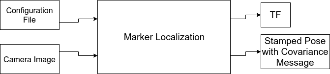

# BIR Marker Localization

Hello fellows! 

Localization problem is one of the most commom in robotics. This package was made to help you find your robot. All you need is a camara and artificial markers!

"But I don't know what artificial markers are... :sob:'' No problem! Just look at [**THIS**](https://docs.opencv.org/trunk/d5/dae/tutorial_aruco_detection.html) or [**THIS**](https://docs.google.com/document/d/1QU9KoBtjSM2kF6ITOjQ76xqL7H0TEtXriJX5kwi9Kgc/edit) library description, we used to develop this package.

## Localization Problem

There are two ways two use this package. You can either try to locate your robot or a structure in the enviroment. There are below two graphic representation for these cases. The graph's arrows represents tf connections from parent to child. Blue means that is a known tf, pink 

## Getting Started

Before get your hands dirty, you'll need to install some stuff. Please follow the instalation guide and you'll be all set!

### Prerequisites

- ##### [ROS](http://wiki.ros.org/ROS/Installation)
- ##### [OpenCV 3.3.1](https://www.learnopencv.com/install-opencv3-on-ubuntu/)

> Make sure that ros is working with this opencv version, otherwise during compilation of older opencv the compiler will report that it didn't find cornerRefinementMethod

### Installing

A step by step series of examples that tell you how to get a development env running

#### Download the Package
```
~/catkin_ws/src$ git clone -b develop https://github.com/Brazilian-Institute-of-Robotics/msub_marker_localization.git
```

#### Download the Package ROS Dependencies

```
~/catkin_ws$ rosdep install --from-paths src --ignore-src -r -y
```

#### Build the package
```
~/catkin_ws$ catkin build marker_localization
```
> If any error occurs here, build it again.

## How it works

### Set Configuration File
Inside config folder there is a default config file. It's possible create how many as needed.

Important: The variable set using a vector must always have a floating point.
> Example: params vector: [1.0, 2.0, 3.0]

Look up that 1.0 represents an integer 1.

#### Configuration Words:

### Overall types and default values table

| Configuration Name:       | Type             | Example Value                             | Required param: |
|---------------------------|------------------|-------------------------------------------|-----------------|
| debug                     | bool             | true                                      | [ ]             |
| pose_topic                | string           | zed_right_pose                            | [ ]             |
| publish_frequecy          | int              | 60                                        | [ ]             |
| enable_tf                 | bool             | true                                      | [ ]             |
| camera_transform_name     | string           | zed_right_tf                              | [ ]             |
| camera_reference_tf       | string           | world                                     | [ ]             |
| camera_matrix             | vector of double | [fx, 0.0, cx, 0.0, fy, cy, 0.0, 0.0, 1.0] | [ ]             |
| camera_distortion         | vector of double | [k1, k2, k3, k4, k5]                      | [ ]             |
| image_topic               | string           | /camera/right/image_raw                   | [ ]             |
| marker_publish_topic_name | string           | /found_markers_right                      | [ ]             |
| marker_dictionary         | int              | 11                                        | [x]             |
| markers_length            | vector of double | [150]                                     | [x]             |
| markers_                  | vector of double | [0.0, 1.0, 2.0, 3.0]                      | [x]             |
| marker_name               | string           | aruco_6x6_                                | [ ]             |
| aruco_transform_namespace | string           | panelTF/                                  | [ ]             |
| aruco_reference_tf        | string           | /tag                                      | [ ]             |


### Parameters description

1. start_aruco_pose_estimate

1. debug
    - If true, it will print parameters that are being used as also the ROI and aruco identification in the image

1. pose_topic
    - Name of the topic that your robot pose will be publish

1. enable_tf
    - If true, it will also link your robot pose in tf tree, else it will only publish in specified pose_topic

1. image_topic
    - Image from camera used for localization topic

1. markers_length (mm)
    - Size of aruco lateral dimension, for each size you will need to also specify which ids arucos with this size have in markers_

1. markers_
    - For each length you need to create a vector with this size ids. You need to concatenade the parameter name with its length.
    - Example: If you specified [100,150] in markers_length, then you need to create markers_150 and markers_100 parameters. 

1. marker_dictionary
    - This indicates the type of aruco you are using. Aruco type is defined by how many black and white squares are in a row or column and how many different aruco's patterns from this type there is.
    - These are the configurations availble:

        0 = 4x4 with 50 patterns

        1 = 4x4 with 100 patterns

        2 = 4x4 with 250 patterns

        3 = 4x4 with 1000 patterns

        4 = 5x5 with 50 patterns

        5 = 5x5 with 100 patterns

        6 = 5x5 with 250 patterns

        7 = 5x5 with 1000 patterns

        8 = 6x6 with 50 patterns

        9 = 6x6 with 100 patterns

        10 = 6x6 with 250 patterns

        11 = 6x6 with 1000 patterns

        12 = 7x7 with 50 patterns

        13 = 7x7 with 100 patterns

        14 = 7x7 with 250 patterns

        15 = 7x7 with 1000 patterns

        16 = Aruco Original
        
    - Keep in mind that the fewer patterns the faster the program. 

1. marker_publish_topic_name


https://docs.opencv.org/3.4.2/dc/df7/dictionary_8hpp.html



